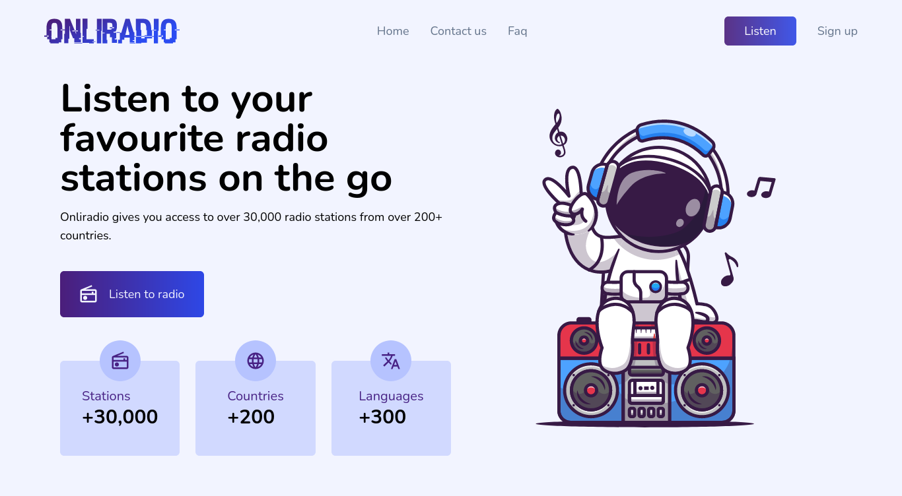

# Onliradio

Onliradio is a radio station player that can search and play radio stations identified in over 190 countries. Onliradio uses [Radio Browser](https://www.radio-browser.info/) api to which aggregates radio stations from all over the world. 
You can view the final app on [Onliradio](https://onliradio.vercel.app/).

## Technologies used

- Typescript
- Node js
- Next js
- React js
- Tailwind Css

## Features

- [x] Play and Pause Audio
- [x] Search through Stations using filters e.g Country,Genre,Name and Language
- [ ] Increase/Reduce volume
- [x] View Local Station on app homepage
- [ ] View recently played stations
- [ ] Setup Like functionality

## Requirements

What do I need to run onliradio locally ?

- Node js version 16 and above
- Npm(Node package Manager) version 8 and above

## How to get Started

1. Clone the repo
2. Run `npm install` to install all packages
3. Run `npm run dev` to start local server
4. Run `npm run build` to build for production
